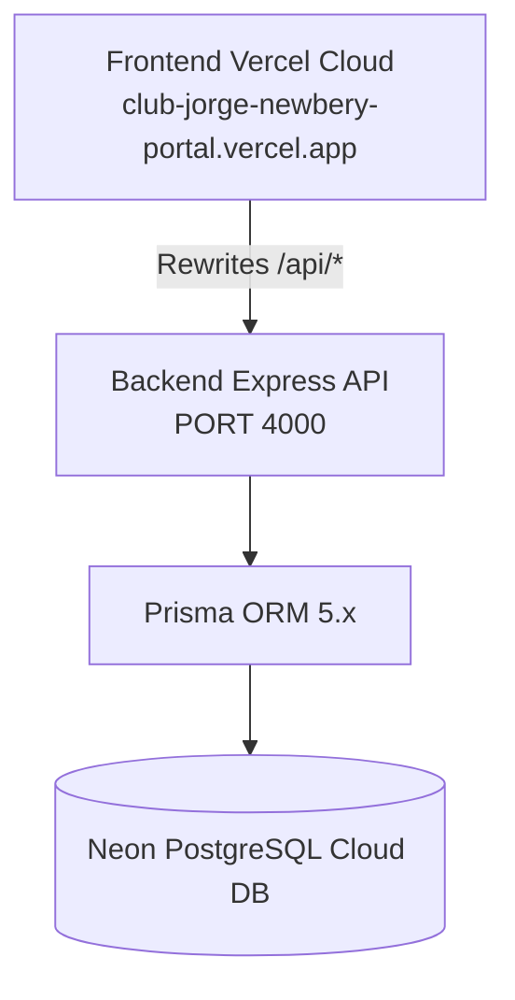

# Documentación Oficial: Arquitectura Frontend Producción

**Plataforma**: Club Atlético Jorge Newbery Digital  
**Repositorio**: `mglenvios-cloud/club-jorge-newbery`  
**Proyecto Vercel**: `frontend`  
**Deployment ID**: `dpl_5Xr31J7FHMJPy5nx5vbBhF1ojTgW`  
**Dominio Oficial**: `https://club-jorge-newbery-portal.vercel.app`  
**Commit de Referencia Estable**: `2136a6a` ("Production stable - restore frontend routing")  
**Tag de Versión**: `production-stable-v1`  
**Fecha de Documentación**: 31 de Julio de 2026  

---

## 1. Arquitectura Next.js App Router

### Stack Tecnológico Principal
* **Framework**: Next.js 14.2.35 (App Router)
* **Lenguaje**: TypeScript 5.3+
* **Estilos**: Tailwind CSS 3.4+ y tokens de CSS personalizados
* **Componentes & UI**: Lucide React + Tailwind Merge + Clsx
* **Control de Navegación**: App Router estricto (`frontend/src/app/`)
* **Contextos de Aplicación**: `AuthProvider`, `TenantProvider`, `AppProviders`

---

## 2. Estructura de Carpetas (`frontend/src`)

```
frontend/src/
├── app/                      # Rutas físicas del App Router de Next.js
│   ├── (public)/             # Rutas públicas (Landing, Contacto, Precios, Demo, Login, Registro)
│   ├── admin/                # Consola Corporativa Admin & Contabilidad
│   ├── super-admin/          # Consola Global Super Admin SaaS
│   ├── dashboard/            # Dashboard Institucional del Club (Socios, Deportes, Finanzas, TV, Canchas)
│   ├── portal/               # Portal de Autoservicio del Socio (Carnet, Reservas, Pagos)
│   ├── globals.css           # Estilos globales y tokens de diseño
│   ├── layout.tsx            # Layout principal raíz
│   ├── page.tsx              # Landing Page oficial del club
│   ├── robots.ts             # Configuración SEO de robots.txt
│   └── sitemap.ts            # Sitemap dinámico
├── components/               # Componentes UI reutilizables
│   ├── admin/                # UI Consola Administrativa (SuperAdminSidebar, SuperAdminHeader)
│   ├── dashboard/            # UI Dashboard Institucional (Widgets, tablas)
│   ├── layout/               # Elementos del Shell (Header, Sidebar)
│   ├── portal/               # UI Portal del Socio (Carnet, reservas)
│   └── providers/            # AuthProvider, TenantProvider, AppProviders
```

---

## 3. Mapa Completo de Rutas (70 Rutas Generadas)

### A. Módulos Públicos
* `/` - Portal Institucional Oficial del Club Atlético Jorge Newbery
* `/contact` - Formulario de contacto
* `/pricing` - Cuotas Sociales e información de socios
* `/register-club` - Registro e incorporación de instituciones
* `/login` - Acceso unificado de socios y administradores
* `/features` - Catálogo de funcionalidades del sistema
* `/demo` - Demostración interactiva
* `/tv` - Transmisiones y eventos públicos del club

### B. Portal Socio (`/portal`)
* `/portal` - Panel principal del socio
* `/portal/carnet` - Carnet digital interactivo de socio
* `/portal/bookings` - Reserva de canchas e instalaciones
* `/portal/payments` - Consulta y pago de cuotas sociales
* `/portal/notifications` - Centro de avisos institucionales
* `/portal/profile` - Perfil de usuario y datos personales

### C. Admin Corporativo & Contabilidad (`/admin`)
* `/admin` - Dashboard Ejecutivo
* `/admin/contabilidad` - **Módulo de Contabilidad y Balance Financiero** (Vista canónica restaurada)
* `/admin/audit` - Auditoría de acciones y seguridad
* `/admin/billing` - Facturación SaaS y control de MRR
* `/admin/branding` - Personalización visual global
* `/admin/clubs` & `/admin/clubs/wizard` - Gestión e incorporación asistida de clubes
* `/admin/licenses` - Administración de licencias de uso
* `/admin/marketplace` - Tienda de módulos y add-ons
* `/admin/modules` - Módulos globales del sistema
* `/admin/plans` - Definición de planes SaaS
* `/admin/settings` - Ajustes generales corporativos
* `/admin/users` - Usuarios y administradores

### D. Super Admin SaaS (`/super-admin`)
* `/super-admin` - Métricas ejecutivas globales
* `/super-admin/analytics` - Analíticas avanzadas
* `/super-admin/clubs` - Directorio central de instituciones
* `/super-admin/leads` - Gestión de prospectos comerciales
* `/super-admin/modules` - Control centralizado de módulos
* `/super-admin/plans` - Tarifario global
* `/super-admin/subscriptions` - Control de suscripciones activas

### E. Dashboard Club (`/dashboard`)
* `/dashboard` - Panel de control principal del club
* **Finanzas**: `/dashboard/finance`, `/dashboard/finance/cash`, `/dashboard/finance/collections`, `/dashboard/finance/expenses`, `/dashboard/finance/income`, `/dashboard/finance/invoices`, `/dashboard/finance/memberships`, `/dashboard/finance/payments`, `/dashboard/finance/reports`, `/dashboard/finance/treasury`.
* **Socios**: `/dashboard/members`, `/dashboard/members/new`, `/dashboard/members/[id]`.
* **Instalaciones**: `/dashboard/facilities`.
* **Deportes**: `/dashboard/sports`, `/dashboard/sports/matches`, `/dashboard/sports/rosters`, `/dashboard/sports/stats`, `/dashboard/sports/tournaments`, `/dashboard/sports/trainings`.
* **TV & Media Center**: `/dashboard/tv`, `/dashboard/tv/ads`, `/dashboard/tv/media`, `/dashboard/media-center`, `/dashboard/media-center/ai-creator`, `/dashboard/media-center/documents`, `/dashboard/media-center/historical`, `/dashboard/media-center/news`, `/dashboard/media-center/photos`, `/dashboard/media-center/videos`.
* **Configuración**: `/dashboard/settings`.

---

## 4. Dependencias Críticas de la Infraestructura



1. **Vercel Cloud Deployment**:
   * Despliegue serverless continuo vinculado a la rama `main` de GitHub.
   * Manejo de dominio oficial: `https://club-jorge-newbery-portal.vercel.app`.
2. **Backend API (Express / Node.js)**:
   * Expone la API REST en el puerto 4000 (o URL de producción).
3. **Prisma ORM**:
   * Administrador del modelo de datos (`backend/prisma/schema.prisma`).
4. **Neon PostgreSQL Cloud DB**:
   * Base de datos serverless en la nube con alta disponibilidad.

---

## 5. Reglas de Mantenimiento

### Reglas sobre Rewrites (`next.config.js`)
* **PROHIBIDO**: Crear reglas de `rewrites` en `next.config.js` para rutas que tengan un archivo de página nativo (`page.tsx`) en el directorio `src/app/`.
* **Razón**: Next.js procesa las reglas de `rewrites` antes del ruteo estático/dinámico de App Router. Esto provoca colisiones de ruteo, bucles de redirección (HTTP 302) y errores HTTP 404 en producción.

### Política de Backups Git
* Todo cambio crítico o entrega de versión debe respaldarse con un **Tag Git de versión** (`git tag production-stable-vX`).
* La rama `main` del repositorio `mglenvios-cloud/club-jorge-newbery` representa siempre el código fuente oficial de producción.

---

## 6. Roadmap Técnico Recomendado

1. **Middleware de Autenticación (`src/middleware.ts`)**:
   * Implementar `middleware.ts` en la raíz de `frontend/src/` para interceptar requests en Edge y validar tokens JWT antes del renderizado de componentes.
2. **Unificación de Consolas Administrativas**:
   * Consolidar el menú lateral y las vistas de `/super-admin` y `/admin` bajo una estructura unificada basada en permisos de usuario (RBAC).
3. **Optimización de Renderizado y Caché**:
   * Utilizar revalidación de tags en Next.js App Router para mantener sincronizados los balances de tesorería y estados de socios en tiempo real.
