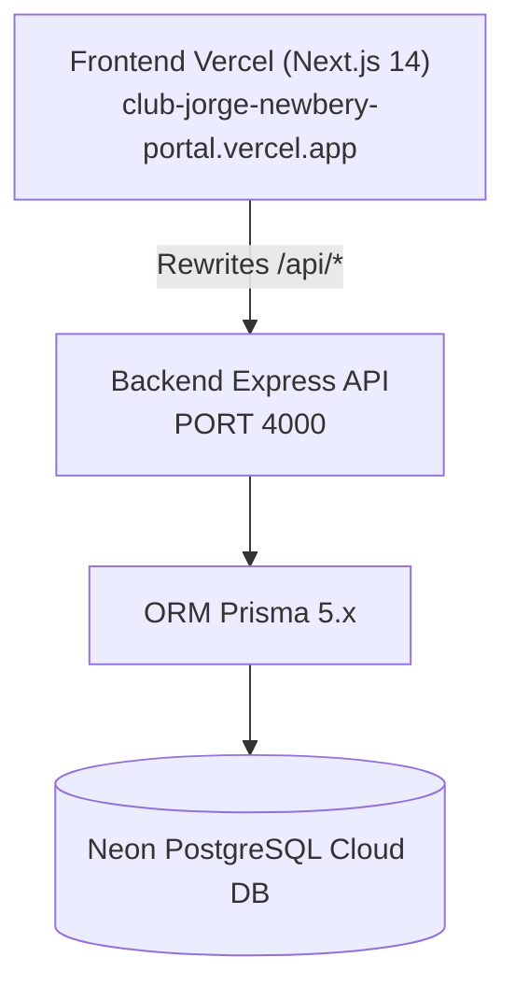

# Documentación Técnica: Arquitectura Frontend Producción Estable

**Plataforma**: Club Atlético Jorge Newbery Digital  
**Repositorio**: `mglenvios-cloud/club-jorge-newbery`  
**Proyecto Vercel**: `frontend`  
**Dominio Oficial**: `https://club-jorge-newbery-portal.vercel.app`  
**Deployment ID**: `dpl_5Xr31J7FHMJPy5nx5vbBhF1ojTgW`  
**Commit de Referencia**: `2136a6a` ("Production stable - restore frontend routing")  
**Tag de Versión**: `production-stable-v1`  
**Fecha de Publicación**: 31 de Julio de 2026  

---

## 1. Arquitectura Actual del Frontend

### Core Tecnológico
* **Framework**: Next.js 14 (App Router)
* **Lenguaje**: TypeScript 5.3+
* **Estilos**: Tailwind CSS 3.4+ + Vanilla CSS utilities
* **Iconografía & UI**: Lucide React + Tailwind Merge + Clsx
* **Arquitectura de Ruteo**: App Router estricto (`frontend/src/app/`)
* **Gestión de Estado & Auth**: React Context API (`AuthProvider`, `TenantProvider`)

### Estructura de Directorios (`frontend/src/`)
```
frontend/src/
├── app/                      # Rutas físicas del App Router de Next.js
│   ├── (public)/             # Rutas públicas (Landing, Contacto, Precios, Demo, Login, Registro)
│   ├── admin/                # Consola Corporativa Admin & Contabilidad
│   ├── super-admin/          # Consola Global Super Admin SaaS
│   ├── dashboard/            # Dashboard Institucional del Club (Socios, Deportes, Finanzas, TV, Canchas)
│   ├── portal/               # Portal de Autoservicio del Socio (Carnet, Reservas, Pagos)
│   ├── globals.css           # Estilos globales y tokens CSS
│   └── layout.tsx            # Layout raíz de la aplicación
├── components/               # Componentes UI reutilizables
│   ├── admin/                # Sidebar, Header y componentes de administración
│   ├── dashboard/            # Componentes del dashboard del club
│   ├── layout/               # Shell de navegación general
│   ├── portal/               # Componentes del portal del socio
│   └── providers/            # AuthProvider, TenantProvider, AppProviders
```

---

## 2. Mapa Completo de Rutas (70 Rutas Generadas)

### A. Portal Público Institucional
* `/` - Página principal / Landing oficial del Club Atlético Jorge Newbery
* `/contact` - Formulario de contacto institucional
* `/pricing` - Cuotas Sociales e información de membresías
* `/register-club` - Registro e incorporación de nuevos clubes / filiales
* `/login` - Acceso unificado de usuarios y administradores
* `/features` - Presentación de características del portal digital
* `/demo` - Demostración interactiva del sistema
* `/tv` - Pantalla pública de transmisiones y eventos del club

### B. Portal de Autoservicio del Socio (`/portal`)
* `/portal` - Dashboard principal del socio
* `/portal/carnet` - Carnet digital interactivo de socio
* `/portal/bookings` - Reserva de canchas e instalaciones
* `/portal/payments` - Pago de cuotas y estado de cuenta
* `/portal/notifications` - Centro de notificaciones institucionales
* `/portal/profile` - Perfil de socio y datos personales

### C. Consola Administrativa & Contabilidad (`/admin`)
* `/admin` - Dashboard Ejecutivo Corporativo
* `/admin/contabilidad` - **Módulo de Contabilidad y Balance Financiero** (Vista canónica recuperada)
* `/admin/audit` - Registro de auditoría y seguridad
* `/admin/billing` - Facturación SaaS y MRR
* `/admin/branding` - Gestión de identidad visual y colores
* `/admin/clubs` & `/admin/clubs/wizard` - Gestión de clubes e incorporación asistida
* `/admin/licenses` - Control de licencias activas
* `/admin/marketplace` - Tienda de módulos y extensiones
* `/admin/modules` - Configuración de módulos globales
* `/admin/plans` - Configuración de planes SaaS
* `/admin/settings` - Ajustes corporativos del sistema
* `/admin/users` - Gestión de administradores y usuarios

### D. Consola Super Admin SaaS (`/super-admin`)
* `/super-admin` - Panel principal de métricas corporativas
* `/super-admin/analytics` - Analíticas avanzadas de uso
* `/super-admin/clubs` - Listado consolidado de instituciones
* `/super-admin/leads` - Gestión de prospectos e interesados
* `/super-admin/modules` - Control centralizado de módulos
* `/super-admin/plans` - Planes globales
* `/super-admin/subscriptions` - Control de suscripciones recurrentes

### E. Dashboard Institucional del Club (`/dashboard`)
* `/dashboard` - Panel de control general del club
* **Finanzas**: `/dashboard/finance`, `/dashboard/finance/cash`, `/dashboard/finance/collections`, `/dashboard/finance/expenses`, `/dashboard/finance/income`, `/dashboard/finance/invoices`, `/dashboard/finance/memberships`, `/dashboard/finance/payments`, `/dashboard/finance/reports`, `/dashboard/finance/treasury`.
* **Socios**: `/dashboard/members`, `/dashboard/members/new`, `/dashboard/members/[id]`.
* **Instalaciones & Canchas**: `/dashboard/facilities`.
* **Deportes & Torneos**: `/dashboard/sports`, `/dashboard/sports/matches`, `/dashboard/sports/rosters`, `/dashboard/sports/stats`, `/dashboard/sports/tournaments`, `/dashboard/sports/trainings`.
* **Streaming & Media Center**: `/dashboard/tv`, `/dashboard/tv/ads`, `/dashboard/tv/media`, `/dashboard/media-center`, `/dashboard/media-center/ai-creator`, `/dashboard/media-center/documents`, `/dashboard/media-center/historical`, `/dashboard/media-center/news`, `/dashboard/media-center/photos`, `/dashboard/media-center/videos`.
* **Configuración**: `/dashboard/settings`.

---

## 3. Dependencias Críticas de la Arquitectura



1. **Vercel Cloud Deployment**:
   * Maneja el hosting estático/Serverless del frontend en `https://club-jorge-newbery-portal.vercel.app`.
   * Realiza `rewrites` automáticos en `next.config.js` para delegar `/api/*` al backend de Node.js/Express.
2. **Backend API (Node.js / Express)**:
   * Provee los endpoints de API REST bajo `/api/...`.
3. **Prisma ORM**:
   * Mantiene el esquema de datos (`backend/prisma/schema.prisma`).
4. **Neon PostgreSQL Cloud**:
   * Base de datos PostgreSQL Serverless donde reside la información institucional.

---

## 4. Reglas de Mantenimiento

> [!IMPORTANT]
> **REGLA 1: Respetar las rutas físicas de Next.js App Router**
> No agregar reglas de `rewrites` en `next.config.js` para rutas que ya posean un archivo `page.tsx` dentro de `src/app/`. Hacerlo provocará colisión de ruteo y errores HTTP 404/302 en producción (tal como ocurrió previamente en `/admin/contabilidad`).

> [!WARNING]
> **REGLA 2: No agregar redirecciones innecesarias**
> Cualquier nueva vista o submódulo debe crearse como una carpeta dentro de `src/app/` siguiendo la convención estándar del App Router (`src/app/nombre-modulo/page.tsx`).

> [!CAUTION]
> **REGLA 3: Puntos de Respaldo Obligatorios antes de Grandes Cambios**
> Antes de realizar refactorizaciones mayores o despliegues estructurales, crear siempre un tag Git etiquetado (`git tag production-stable-vX`) para permitir la reversión inmediata al último estado estable verificado.

---

## 5. Roadmap Técnico Recomendado

1. **Implementación de Middleware de Seguridad (`src/middleware.ts`)**:
   * Agregar un `middleware.ts` en Next.js para validar JWTs en el Borde (*Edge*) antes de renderizar rutas protegidas de `/admin/*` y `/dashboard/*`.
2. **Unificación de Consolas Administrativas**:
   * Consolidar las vistas de `/super-admin/*` y `/admin/*` en un único esquema con control de acceso basado en roles (*RBAC*) para simplificar la experiencia de usuario y evitar código duplicado.
3. **Optimización de Caché y Revalidación de API**:
   * Utilizar `revalidatePath` y `revalidateTag` de Next.js en las llamadas a la API para asegurar actualizaciones en tiempo real de saldos contables y registros de socios.
